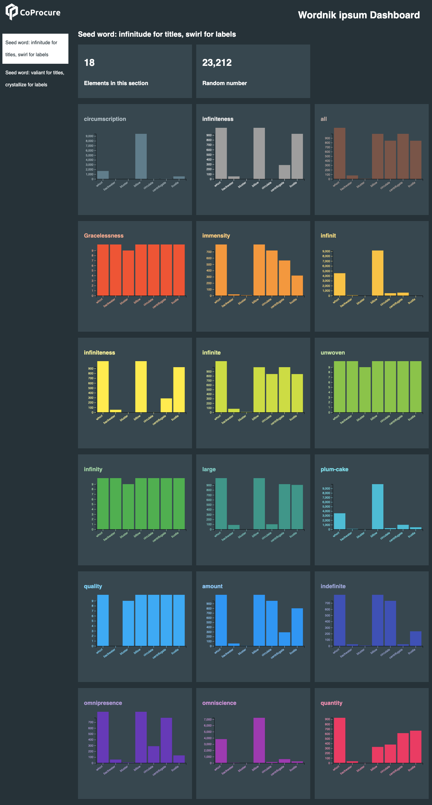

# Rainbow Dashboard

A dashboard that displays a set of charts in rainbow colors



## How to use

The <a href="index.html">index.html</a> file is an example of how to use this, create your own HTML file with the: ```<rainbow-dash>``` custom element. Provide the url of your data json file as the ```data-src``` attribute value and include the source javascript file in your page. 

## Data format

```
{
  "meta": {
    "logo": ""
  },
  "sections": [
    {
      "title": "Cool Data"
      "content": { 
        headers: [
          {
            "text": "ABC",
            "value": 123
          }
        ],
        charts: [
          {
            "type": "bar",
            "title": "A bar chart",
            "data": {
              "fieldname": "value", 
              "fieldname2": "value2" 
            }
          }
        ]
      }
    }
  ]
}
```

- Each section will appear as a sidebar link
- The content in each section will be displayed in the main area when that link is selected
- Data for each chart is a json object

Sample dataset labels powered by <a href="https://wordnik-ipsum.glitch.me/">Wordnik ipsum</a>